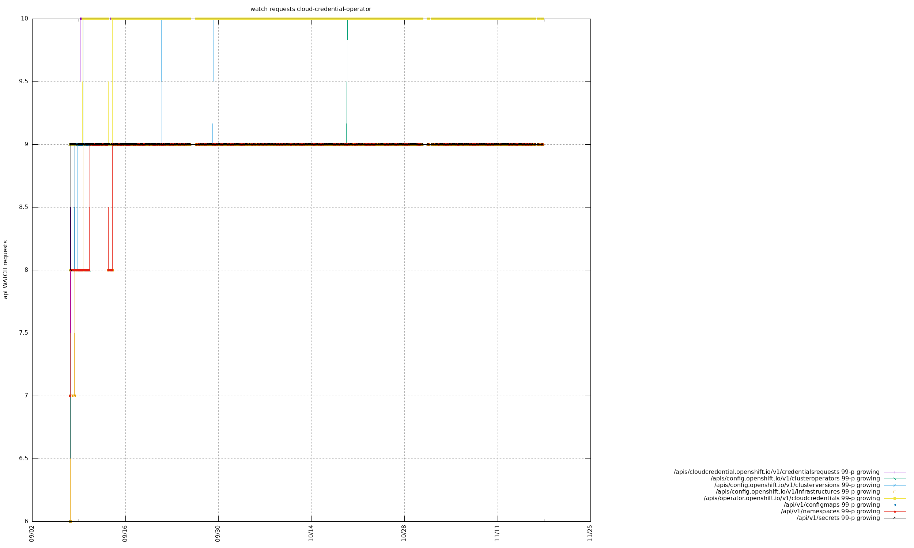
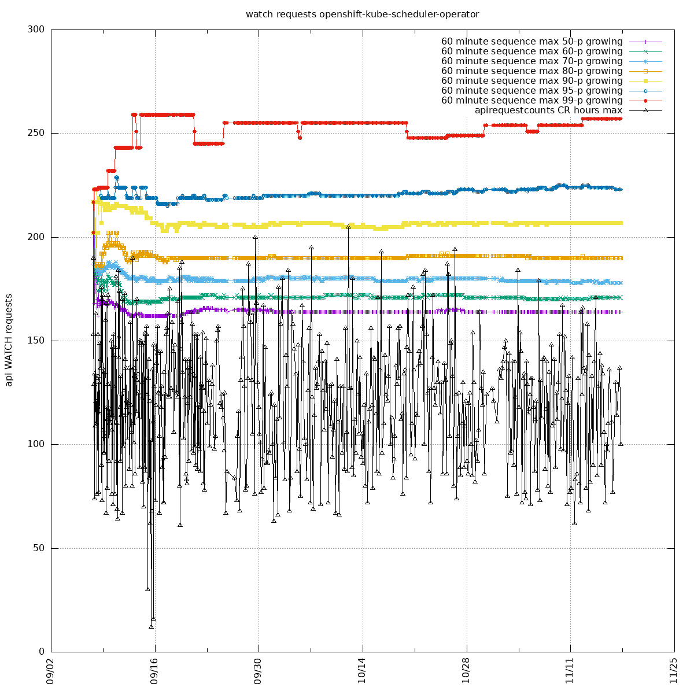
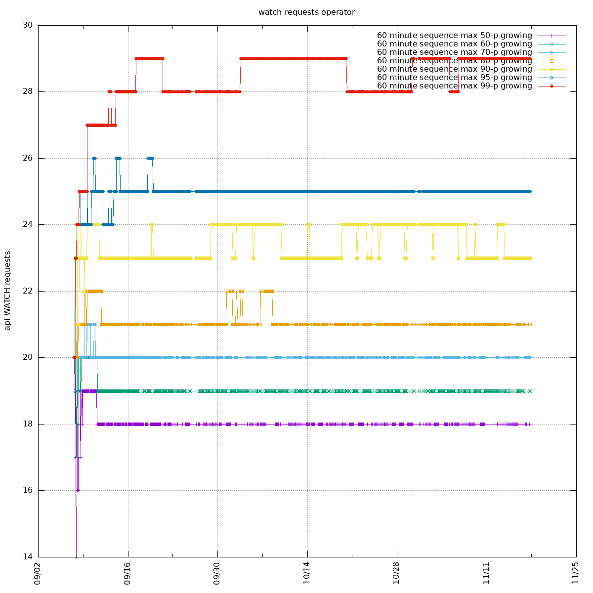

### periodic-ci-openshift-release-master-ci-4.10-e2e-gcp

Attaching 99-th percentiles of individual resources (computed by the same mechanism
by selecting the interval with the maximum quantity) for the first operators
for demonstration. For other operators just in case there are some resources
with significant changes.

In general, most of the operators are showing slow growth or oscillating.
Most of the percentiles are usually steady.
The 99-th percentiles are sensitive to spikes so they register most of the
changes. Thus, growing up the most.

The 50-th percentile (median) corresponds to the most common quantity.
The steady line signifies the most of the time the watch requests are
requested steadily. If you carefully check all percentiles up to the 80-th, you will not see
many changes.

If you pay attention to cluster-monitoring-operator, you can see all the percentiles are
growing up at the end. Which is a good indication for investigating the operator further.

#### authentication-operator

There 52 different resources requested by the operator.
All the resources are either holding steady/alternating the 99-th percentile.
Or, gradually increasing by 1-2 points. There's no single point where all the
resources started to grow simultaneously.

#### cloud-credential-operator

#### cluster-autoscaler-operator

#### cluster-baremetal-operator

#### cluster-capi-operator

#### cluster-image-registry-operator

#### cluster-monitoring-operator

The watch requests includes the following resources:
- /apis/certificates.k8s.io/v1/certificatesigningrequests
- /apis/config.openshift.io/v1/apiservers
- /apis/config.openshift.io/v1/infrastructures
- /api/v1/namespaces/kube/system/configmaps
- /api/v1/namespaces/openshift/config/configmaps
- /api/v1/namespaces/openshift/config/managed/configmaps
- /api/v1/namespaces/openshift/monitoring/configmaps
- /api/v1/namespaces/openshift/monitoring/persistentvolumeclaims
- /api/v1/namespaces/openshift/monitoring/secrets
- /api/v1/namespaces/openshift/user/workload/monitoring/configmaps
- /api/v1/namespaces/openshift/user/workload/monitoring/persistentvolumeclaims

Resources with the most significant changes are `/api/v1/namespaces/openshift/monitoring/persistentvolumeclaims` and `/api/v1/namespaces/openshift/user/workload/monitoring/persistentvolumeclaims`. The remaining resources keep the 99-th percentile with 1 point delta:

#### cluster-node-tuning-operator

#### cluster-samples-operator

#### cluster-storage-operator

#### console-operator

#### csi-snapshot-controller-operator

#### dns-operator

#### etcd-operator

#### gcp-pd-csi-driver-operator

#### ingress-operator

#### kube-apiserver-operator

#### kube-controller-manager-operator

#### kube-storage-version-migrator-operator

#### machine-api-operator

#### marketplace-operator

#### openshift-apiserver-operator

#### openshift-config-operator

#### openshift-controller-manager-operator

#### openshift-kube-scheduler-operator

#### operator

#### prometheus-operator

#### service-ca-operator

