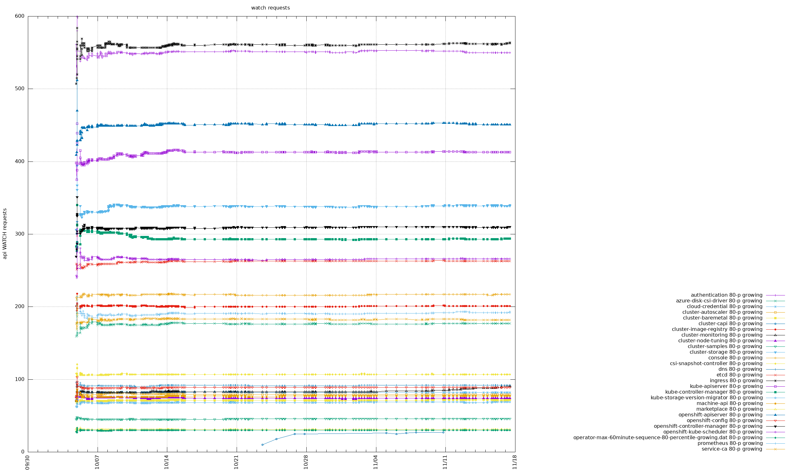

# Watch API requests report

The report discusses development of growth of number of watch API requests in time.
Observed per each operator throughout 4.10 informing and blocking jobs.
The main source of the watch API requests are the apirequestscount CRD and
kube-apiserver audit logs. The former provides an aggregated sum of the requests
in form of 24 buckets captured for each hour in a day.
The latter provides individual requests for more detailed analysis.

The analysis mainly focuses on observing the maximum number of watch API requests
in any one hour long interval. The apirequestscount CRD aggregates the requests
in predefined intervals (e.g. 11:00:00 - 11:59:59). Given a test suite can start
and finish running at any time, the requests can be divided among the apirequestscount
buckets randomly. E.g. a test suite starting at 10:30 and finishing at 11:30 may
produce an apirequestscount CR with 10:00:00-10:59:59 bucket and 11:00:00-11:59:59
bucket of a different quantity than a test suite starting at 10:50 and finishing
at 11:50. To eliminate the time shift, the analysis processes all audit logs
(produced by a CI run) one by one by checking all one hour long intervals (with
precision to minutes) and takes the one with the maximum quantity.

For each job the analysis focuses on computing various percentiles throughout time.
I.e. percentile(1), percentile(1,2), percentile(1,2,3), ..., percentile(1,2,3,...,n)
where 1,2,3,...,n are measurements from the 1st, 2nd, 3rd, ..., n-th job run.
The dataset of each percentile grows in time taking into account all historical
measurements. This way we can observe how the new measurements (of newer job runs)
changes the percentiles. If the number of watch API requests tests to increase
with newer jobs, the percentiles goes up. Lower percentiles are less sensitive to
changes. Higher percentiles can change more rapidly depending on how much the
number of requests fluctuates among jobs.

By the time of the analysis (2021-11-17) there's:
- 146 informing and 5 blocking jobs in 4.10
- 129 informing and 7 blocking jobs in 4.9
- 106 informing and 7 blocking jobs in 4.8

Cross-correlations in question:
- operators across jobs of all providers
- operators across jobs of the same provider (AWS, Azure, GCP, OpenStack, Metal, vSphere, ...)
- operators across jobs of the same topology (SNO, cucushift, hypershift, ...)
- operators across jobs of all releases (4.8,4.9,4.10)

# Table of Contents
1. [4.10](#410)
    1. [periodic-ci-openshift-release-master-ci-4.10-e2e-gcp](#periodic-ci-openshift-release-master-ci-410-e2e-gcp)
    1. [periodic-ci-openshift-release-master-ci-4.10-e2e-gcp-upgrade](#periodic-ci-openshift-release-master-ci-410-e2e-gcp-upgrade)
    1. [periodic-ci-openshift-release-master-ci-4.10-e2e-aws-ovn-upgrade](#periodic-ci-openshift-release-master-ci-410-e2e-aws-ovn-upgrade)
    1. [periodic-ci-openshift-release-master-ci-4.10-e2e-azure-ovn-upgrade](#periodic-ci-openshift-release-master-ci-410-e2e-azure-ovn-upgrade)

## 4.10

The 99-th percentiles are sensitive to spikes so they register most of the
changes. Thus, growing up the most. The 50-th percentile (median) corresponds to the most common quantity.
The steady line signifies the most of the time the watch requests are
requested steadily.

### periodic-ci-openshift-release-master-ci-4.10-e2e-gcp

Percentiles for individual operators are located under
[periodic-ci-openshift-release-master-ci-4.10-e2e-gcp/periodic-ci-openshift-release-master-ci-4.10-e2e-gcp.md](periodic-ci-openshift-release-master-ci-4.10-e2e-gcp/periodic-ci-openshift-release-master-ci-4.10-e2e-gcp.md)

In general, most of the operators are showing slow growth or oscillating.
Most of the percentiles are usually steady. If you carefully check all
percentiles up to the 80-th, you will not see many changes.

If you pay attention to cluster-monitoring-operator, you can see all the percentiles are
growing up at the end. Which is a good indication for investigating the operator further.

For an overall view (recommend to check how the percentiles change for individual
operators to understand their meaning):

#### 50-th percentile

#### 80-th percentile

#### 99-th percentile

### periodic-ci-openshift-release-master-ci-4.10-e2e-gcp-upgrade

Checking the 50th percentile graph one can see the following operators are growing:
- openshift-controller-manager
- ingres
- cluster-monitoring
- console
- authentication
- openshift-apiserver
- cluster-storage

#### 50-th percentile

#### 80-th percentile

#### 99-th percentile

### periodic-ci-openshift-release-master-ci-4.10-e2e-aws-ovn-upgrade

Checking the 50th percentile graph one can see the following operators are growing:
- ingres
- cluster-storage
- openshift-controller-manager
- cluster-monitoring

#### 50-th percentile

#### 80-th percentile

#### 99-th percentile

### periodic-ci-openshift-release-master-ci-4.10-e2e-azure-ovn-upgrade

#### 80-th percentile

#### 99-th percentile

